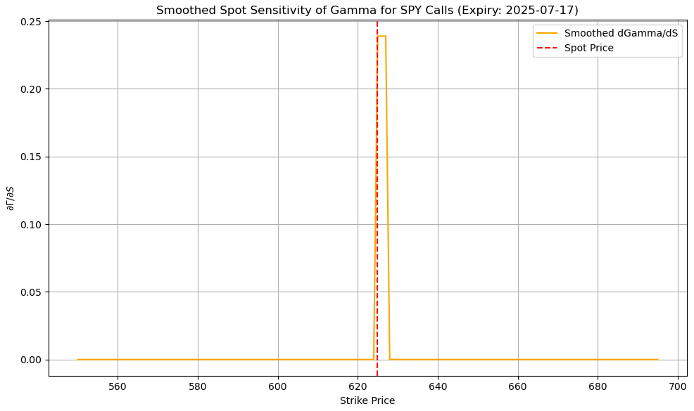
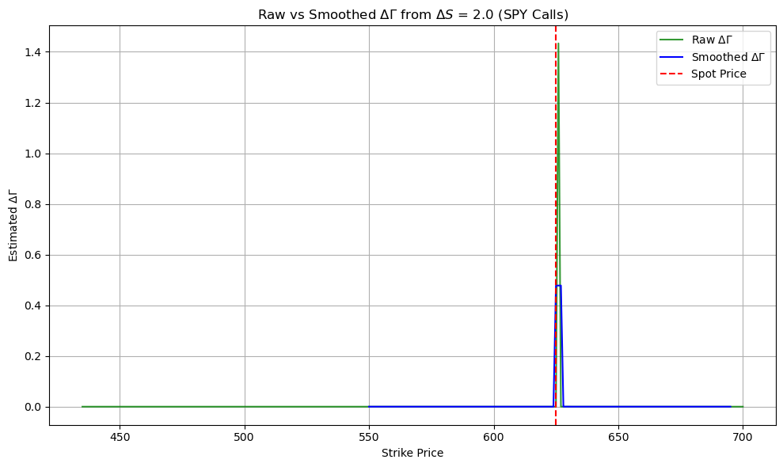
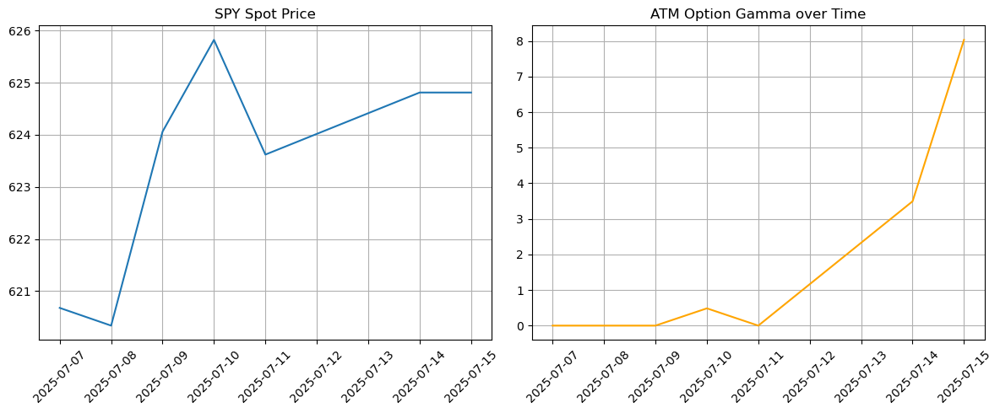
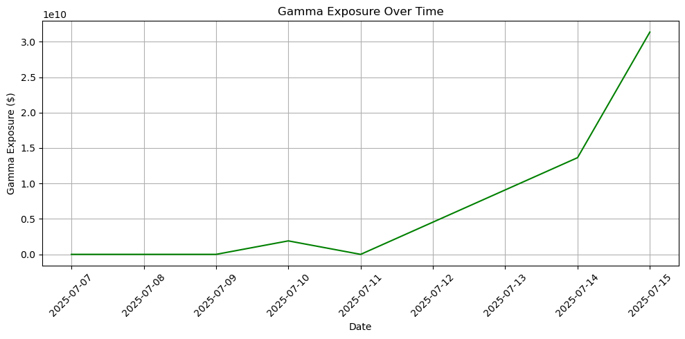
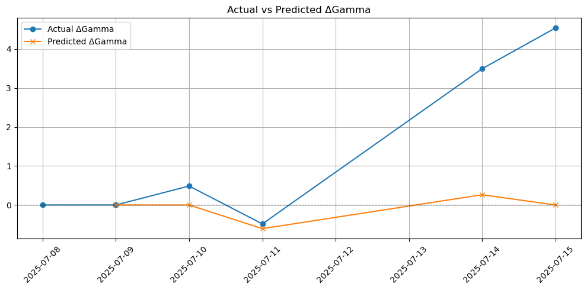

# 📈 Gamma Spot Sensitivity in SPY Options

This project explores how the **Gamma of SPY options** responds to changes in spot price, using the **Black-Scholes model** and real option chain data from Yahoo Finance.

It includes a full simulation pipeline that:

- Computes Black-Scholes Gamma for SPY call options
- Derives the spot sensitivity of Gamma (\(\frac{\partial \Gamma}{\partial S}\))
- Predicts how Gamma changes after a simulated move in spot price
- Tracks SPY spot price and ATM Gamma over time
- Visualizes net Gamma exposure dynamics

---

## 🔍 Project Goals

- Understand the curvature of Gamma across strike prices
- Visualize how Gamma shifts when SPY moves up/down
- Track how market Gamma exposure evolves with time
- Provide a clean foundation for market microstructure or options modeling research

---

## 📊 Visualizations

### 1. Spot Sensitivity of Gamma

This plot shows the numerical derivative \(\frac{\partial \Gamma}{\partial S}\) across strike prices for SPY call options on a given expiry date. The sensitivity curve highlights where Gamma increases/decreases most sharply as the spot price moves.



---

### 2. Raw vs Smoothed \(\Delta \Gamma\) from a Spot Move

We simulate a 2-point move in SPY's spot price and estimate how Gamma would change. This visualization contrasts raw vs smoothed estimates of \(\Delta \Gamma\) across strikes.



---

### 3. SPY Spot Price and ATM Option Gamma Over Time

Tracks how SPY’s daily spot price and the Gamma of the ATM option evolve over time. This provides insight into **Gamma clustering**, particularly near earnings events or macro news.



---

### 4. Aggregate Gamma Exposure Over Time

This chart visualizes **total market Gamma exposure**, estimated using all calls in the option chain. Useful for understanding **dealer positioning** and possible hedging dynamics.



---

### 5. Actual vs Predicted Gamma

This plot compares the actual Gamma computed using Black-Scholes with the predicted Gamma based on a linear approximation.



---

## ⚙️ Dependencies

Install all required Python packages:

```bash
pip install yfinance pandas numpy matplotlib scipy
